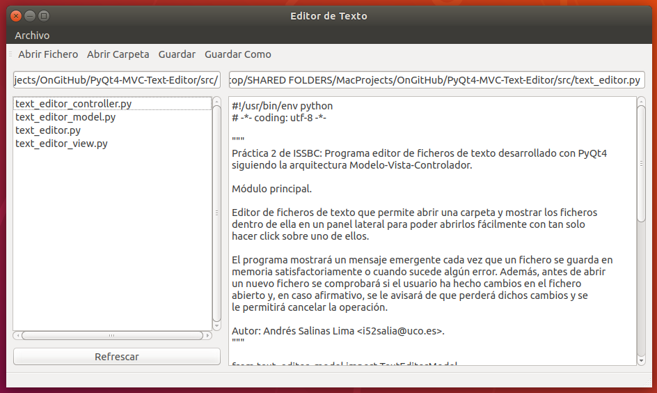

# PyQt4 MVC Text Editor

**Práctica 2 de la asignatura Ingeniería Sistemas Software Basados en Conocimiento.**

Programa editor de ficheros de texto desarrollado con PyQt4 siguiendo la arquitectura Modelo-Vista-Controlador.

Permite abrir una carpeta y mostrar los ficheros dentro de ella en un panel lateral para poder abrirlos fácilmente con tan solo hacer click sobre uno de ellos.

El programa mostrará un mensaje emergente cada vez que un fichero se guarda en memoria satisfactoriamente o cuando sucede algún error. Además, antes de abrir un nuevo fichero se comprobará si el usuario ha hecho cambios en el fichero abierto y, en caso afirmativo, se le avisará de que perderá dichos cambios y se le permitirá cancelar la operación.

